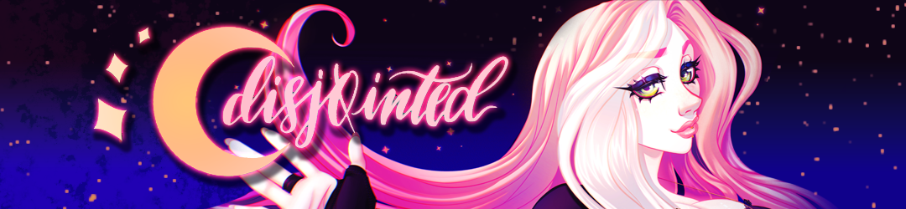

<!--
**disj0inted/disj0inted** is a ✨ _special_ ✨ repository because its `README.md` (this file) appears on your GitHub profile.

Here are some ideas to get you started:

- 🔭 I’m currently working on ...
- 🌱 I’m currently learning ...
- 👯 I’m looking to collaborate on ...
- 🤔 I’m looking for help with ...
- 💬 Ask me about ...
- 📫 How to reach me: ...
- 😄 Pronouns: ...
- ⚡ Fun fact: ...
-->

# disj0inted

---

## 
👤 About Me

<!--

<i>👩 she/her • 🎨 artist • 🎮 gamer • 📚 reader • 🌐 EN</i>

-->

<table>
   <tr>
      <td width="20%">
         👩 she/her  
         🎨 artist  
         🎮 gamer  
         📚 reader  
         🌐 EN
      </td>
      <td width="80%">
         I’m a digital artist who loves bringing personality into spaces through custom HTML/CSS profile design and detailed visual storytelling. My background in character art and worldbuilding shapes everything I create — expressive, atmospheric, and full of narrative hints.    

I also tinker with programming and creative tools, exploring ways technology can support artists, storytellers, and complex imaginative projects behind the scenes.
      </td>
   </tr>
</table>

<!--
 **
🧩 Creative ecosystems • 🗂️ Information architecture • 🎨 Artist-centered tools  
🌍 Worldbuilding platforms • ♿ Accessible creative tech
** 
-->
---

## 
🚧 Current Focus

💤 Getting more sleep  
🖌 Learning Clip Studio Paint  
🌱 Improving creative workflows 

**CORE WORK THEMES** 🎯 Creative tech • Digital asset organization • Platform architecture • Worldbuilding tools

---

## 
🛠️ Skills & Tools

   
**CREATIVE** 🎨 Digital illustration • Character design • Visual storytelling • Worldbuilding • Multimedia asset creation

 

**SOFTWARE** ⚙️ Adobe Creative Suite • Blender • OBS • HTML/CSS customization • Platform & portfolio design

---

### 🌸 Thanks for visiting! 🌸

   
   
   <!-- 
   
   
    -->

